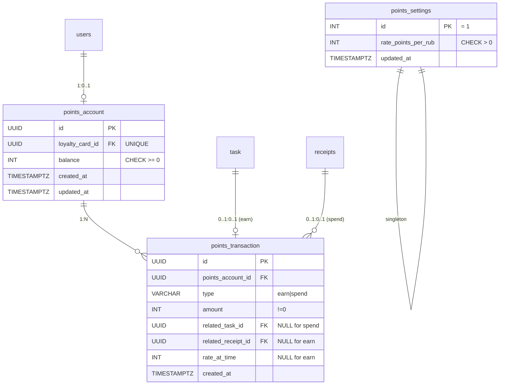

# Data Model: Кешбек в баллах

**Feature**: 007-cashback-points
**Phase**: 1 (Design & Contracts)

Все таблицы — PostgreSQL. Идентификаторы — UUID (совместимо с существующей схемой). Даты — `TIMESTAMPTZ`. Все денежные значения этой фичи — **integer** (баллы и рубли кратны 1). Существующие Numeric-поля (например, `receipt_item.paid_price`) не трогаются.

## Новые сущности

### `points_account` — Счёт баллов пользователя

Один аккаунт на одну карту лояльности. Создаётся лениво: при первом начислении или при первом чтении `GET /points/balance`.

| Column | Type | Nullable | Default | Constraint |
|---|---|---|---|---|
| `id` | UUID | NO | `gen_random_uuid()` | PK |
| `loyalty_card_id` | UUID | NO | — | FK → `users.id` ON DELETE CASCADE, **UNIQUE** |
| `balance` | INT | NO | `0` | `CHECK (balance >= 0)` |
| `created_at` | TIMESTAMPTZ | NO | `now()` | — |
| `updated_at` | TIMESTAMPTZ | NO | `now()` | on update `now()` (server-side trigger не обязателен; сервис проставляет) |

**Индексы**: PK по `id`; UNIQUE по `loyalty_card_id`.

**Инварианты**:
- `balance >= 0` (DB constraint + защита в сервисе).
- Одна запись на одну карту лояльности.

**State machine**: нет (просто счётчик).

---

### `points_transaction` — Транзакция баллов

Иммутабельная запись о начислении или списании. Не редактируется, не удаляется (в PoC).

| Column | Type | Nullable | Default | Constraint |
|---|---|---|---|---|
| `id` | UUID | NO | `gen_random_uuid()` | PK |
| `points_account_id` | UUID | NO | — | FK → `points_account.id` ON DELETE CASCADE |
| `type` | VARCHAR(10) | NO | — | `CHECK (type IN ('earn', 'spend'))` |
| `amount` | INT | NO | — | `CHECK (amount != 0)` — положительное для earn, отрицательное для spend |
| `related_task_id` | UUID | YES | — | FK → `task.id` ON DELETE SET NULL. Заполнено только для `type='earn'`. |
| `related_receipt_id` | UUID | YES | — | FK → `receipts.id` ON DELETE SET NULL. Заполнено только для `type='spend'`. |
| `rate_at_time` | INT | YES | — | Курс, действовавший на момент операции. Для `earn` — NULL (курс не применяется). Для `spend` — обязателен. |
| `created_at` | TIMESTAMPTZ | NO | `now()` | — |

**Индексы**:
- PK по `id`.
- Индекс по `(points_account_id, created_at DESC)` — для пагинации `GET /points/transactions`.
- **Частичный уникальный индекс**: `CREATE UNIQUE INDEX ux_points_tx_earn_task ON points_transaction (related_task_id) WHERE type = 'earn';` — идемпотентность начисления (FR-003).

**Инварианты**:
- `type='earn'` ⇒ `amount > 0`, `related_task_id IS NOT NULL`, `related_receipt_id IS NULL`, `rate_at_time IS NULL`.
- `type='spend'` ⇒ `amount < 0`, `related_task_id IS NULL`, `related_receipt_id IS NOT NULL`, `rate_at_time IS NOT NULL AND rate_at_time > 0`.

**State machine**: нет.

---

### `points_settings` — Настройки баллов (singleton)

Ровно одна строка на всю систему. Создаётся миграцией с дефолтом.

| Column | Type | Nullable | Default | Constraint |
|---|---|---|---|---|
| `id` | INT | NO | — | PK, `CHECK (id = 1)` — singleton lock |
| `rate_points_per_rub` | INT | NO | `10` | `CHECK (rate_points_per_rub > 0)` |
| `updated_at` | TIMESTAMPTZ | NO | `now()` | — |

**Инициализация (в миграции)**: `INSERT INTO points_settings (id, rate_points_per_rub) VALUES (1, 10);`

**Инварианты**:
- Ровно одна строка. `CHECK (id = 1)` + PK гарантируют.
- `rate_points_per_rub > 0` — деление на курс в списании всегда корректно.

---

## Расширяемые сущности

### `receipts` — три новых поля

Все три добавляются в существующую таблицу. Существующие поля не трогаются.

| Column | Type | Nullable | Default | Constraint |
|---|---|---|---|---|
| `cashback_applied_points` | INT | NO | `0` | `CHECK (cashback_applied_points >= 0)` |
| `cashback_applied_rub` | INT | NO | `0` | `CHECK (cashback_applied_rub >= 0)` |
| `points_rate_at_purchase` | INT | YES | — | Курс на момент фиксации. NULL для чеков без списания. |

**Инварианты (проверяются в сервисе, не в БД)**:
- Если `cashback_applied_points > 0` ⇒ `points_rate_at_purchase IS NOT NULL AND points_rate_at_purchase > 0`.
- `cashback_applied_points = cashback_applied_rub × points_rate_at_purchase` (для чеков со списанием).
- `cashback_applied_rub <= sum(receipt_items.paid_price × quantity)` (не больше стоимости чека).

---

## Не изменяемые, но затрагиваемые сущности

### `task` (from spec 006)

- Поле `reward_rub Numeric(10,2)` — источник суммы начисления. Не изменяется.
- Поля `reward_id UUID NULL`, `reward_type VARCHAR default 'discount'` — в новых задачах не заполняются осмысленно (`reward_id = NULL`, `reward_type` остаётся 'discount' по default'у). Схема сохраняется для обратной совместимости; переосмысление — BACKLOG.
- Существующий `CHECK (reward_type IN ('discount'))` остаётся; расширение enum ('points') в отдельной миграции — BACKLOG (не блокирует эту фичу, потому что тип формально не читается).

### `discount` (from spec 005)

Не изменяется. Существующие персональные Discount-записи, созданные как награда (link_task_id NOT NULL), продолжают работать в /calculate — но новые не создаются.

---

## Relationship Diagram (Mermaid)

## Migration Order

1. Создать `points_account` (с UNIQUE `loyalty_card_id`, FK на `users`).
2. Создать `points_transaction` (с FK, частичный UNIQUE индекс, обычный индекс для пагинации).
3. Создать `points_settings` с одной строкой `(1, 10, now())`.
4. `ALTER TABLE receipts` — добавить три колонки с default значениями (чтобы существующие чеки прошли валидацию).

Downgrade: обратный порядок — сначала DROP колонок в receipts, потом три таблицы. Существующие Discount-записи типа «награда» — не затрагиваются миграцией (BACKLOG-cleanup — отдельно).

## Volumes and Access Patterns

- `points_account`: ≤ N пользователей (~1000 в PoC). Access: point-lookup по `loyalty_card_id`, `SELECT ... FOR UPDATE`.
- `points_transaction`: ~2 × N × (заданий в неделю + чеков в неделю) ≈ до 50 тыс. в PoC. Access: append-only INSERT; SELECT с пагинацией по `points_account_id`.
- `points_settings`: 1 строка. Access: SELECT (кэш в приложении на запрос), редкий UPDATE.

Индекс `(points_account_id, created_at DESC)` покрывает основной SELECT-паттерн истории.
