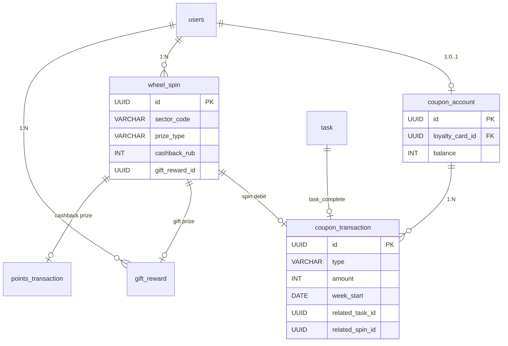

# Data Model: Колесо фортуны и купоны

Все таблицы — PostgreSQL. Идентификаторы — UUID. Даты — `TIMESTAMPTZ`, кроме ключа недели (`DATE`).  
`loyalty_card_id` везде = `users.id` (как в баллах и `gift_reward`).

## Новые таблицы

### `coupon_account`

Один счёт купонов на пользователя. Создаётся лениво при первом обращении к колесу или при начислении за задание.

| Колонка | Тип | Nullable | Default | Ограничение |
|---------|-----|----------|---------|-------------|
| id | UUID | NO | `gen_random_uuid()` | PK |
| loyalty_card_id | UUID | NO | — | FK → `users.id` ON DELETE CASCADE, **UNIQUE** |
| balance | INT | NO | `0` | `CHECK (balance >= 0)` |
| created_at | TIMESTAMPTZ | NO | `now()` | |
| updated_at | TIMESTAMPTZ | NO | `now()` | сервис обновляет при движении |

**Индексы**: PK; UNIQUE `loyalty_card_id`.

**Инварианты**: баланс никогда < 0 (constraint + `FOR UPDATE` в сервисе).

---

### `coupon_transaction`

Иммутабельный леджер. Не обновляется и не удаляется в PoC.

| Колонка | Тип | Nullable | Default | Ограничение |
|---------|-----|----------|---------|-------------|
| id | UUID | NO | `gen_random_uuid()` | PK |
| coupon_account_id | UUID | NO | — | FK → `coupon_account.id` ON DELETE CASCADE |
| type | VARCHAR(20) | NO | — | `CHECK (type IN ('weekly_grant', 'task_complete', 'spin'))` |
| amount | INT | NO | — | `CHECK (amount <> 0)`; >0 начисление, <0 списание |
| related_task_id | UUID | YES | — | FK → `task.id` ON DELETE SET NULL; только `task_complete` |
| related_spin_id | UUID | YES | — | FK → `wheel_spin.id` ON DELETE SET NULL; только `spin` |
| week_start | DATE | YES | — | понедельник недели; только `weekly_grant` |
| created_at | TIMESTAMPTZ | NO | `now()` | |

**Индексы**:
- `(coupon_account_id, created_at DESC)` — пагинация `GET /coupons/transactions`
- **UNIQUE** `ux_coupon_tx_weekly` `(coupon_account_id, week_start)` WHERE `type = 'weekly_grant'`
- **UNIQUE** `ux_coupon_tx_task` `(related_task_id)` WHERE `type = 'task_complete'`
- **UNIQUE** `ux_coupon_tx_spin` `(related_spin_id)` WHERE `type = 'spin'`

**Инварианты (сервис)**:
- `weekly_grant` ⇒ `amount = N` (или 0 не пишется: при N=0 строки нет), `week_start IS NOT NULL`, task/spin NULL
- `task_complete` ⇒ `amount = 1`, `related_task_id IS NOT NULL`
- `spin` ⇒ `amount = -1`, `related_spin_id IS NOT NULL`

---

### `wheel_spin`

Факт кручения и снимок выигранного приза (источник истины для `GET /wheel/spins`).

| Колонка | Тип | Nullable | Default | Ограничение |
|---------|-----|----------|---------|-------------|
| id | UUID | NO | `gen_random_uuid()` | PK |
| loyalty_card_id | UUID | NO | — | FK → `users.id` ON DELETE CASCADE |
| sector_code | VARCHAR(40) | NO | — | стабильный код сектора |
| prize_type | VARCHAR(20) | NO | — | `CHECK IN ('cashback', 'gift')` |
| prize_label | VARCHAR(200) | NO | — | пользовательское название на момент спина |
| cashback_rub | INT | YES | — | для `cashback`; рубли приза |
| gift_reward_id | UUID | YES | — | FK → `gift_reward.id` ON DELETE SET NULL; для `gift` |
| coupons_spent | INT | NO | `1` | `CHECK (coupons_spent = 1)` |
| created_at | TIMESTAMPTZ | NO | `now()` | |

**Индексы**: PK; `(loyalty_card_id, created_at DESC)`.

**Инварианты**:
- `prize_type='cashback'` ⇒ `cashback_rub > 0`, `gift_reward_id IS NULL`
- `prize_type='gift'` ⇒ `gift_reward_id IS NOT NULL`, `cashback_rub IS NULL`
- Ровно один связанный earn в `points_transaction` **или** один `gift_reward` (по типу)

Цикл FK `wheel_spin.gift_reward_id` ↔ `gift_reward.related_spin_id`: вставка спина без `gift_reward_id` → создание подарка со `related_spin_id` → UPDATE спина. Обе ссылки в одной транзакции.

---

## Изменения существующих таблиц

### `gift_reward`

| Изменение | Детали |
|-----------|--------|
| ADD `related_spin_id` | UUID NULL, FK → `wheel_spin.id` ON DELETE SET NULL |

`task_id` по-прежнему NULL для подарка с колеса. Применение в корзине не зависит от источника.

### `points_transaction`

| Изменение | Детали |
|-----------|--------|
| ADD `related_spin_id` | UUID NULL, FK → `wheel_spin.id` ON DELETE SET NULL |
| INDEX `ux_points_tx_earn_spin` | UNIQUE `(related_spin_id)` WHERE `type = 'earn' AND related_spin_id IS NOT NULL` |

Существующий `ux_points_tx_earn_task` не меняется. Для earn со спина: `related_task_id IS NULL`, `related_spin_id IS NOT NULL`, `rate_at_time IS NULL`.

`GET /points/transactions`: поле `related_spin_id` добавить в ответ (nullable), чтобы история баллов показывала источник «колесо».

---

## Сущности без таблиц

### `WheelSector` (каталог в коде)

Не таблица. Значение провайдера:

| Поле | Смысл |
|------|--------|
| code | стабильный ключ |
| label | название для UI |
| description | пояснение выгоды |
| prize_type | `cashback` \| `gift` |
| probability_percent | целое 1–99; сумма списка = 100 |
| cashback_rub | для кешбэка |
| gift_criterion_type | `category` для фиксированного подарка |
| gift_category_name | `кондитерка` — резолв в UUID при выдаче |
| gift_quantity | 1 |

Фиксированный каталог (спека):

| code | prize_type | величина | % |
|------|------------|----------|---|
| small_cashback | cashback | 10 ₽ | 40 |
| medium_cashback | cashback | 30 ₽ | 30 |
| gift_chocolate | gift | 1 ед. категории `кондитерка` | 20 |
| large_cashback | cashback | 100 ₽ | 10 |

---

## Состояния

```
coupon_account.balance: 0..N   (нет статусов)

gift_reward (без изменений):
  active → used | expired

wheel_spin: иммутабельная запись (нет статусов; неуспешный спин не пишется)
```

---

## Диаграмма



---

## Миграции (порядок)

Голова Alembic сейчас: `m1b2c3d4e5f6` (`create_gift_reward`).

1. **M1 `create_coupon_account`** — таблица счёта.
2. **M2 `create_wheel_spin`** — без FK на gift (колонка `gift_reward_id` nullable, FK добавим после, либо сразу FK на уже существующую `gift_reward`).
3. **M3 `create_coupon_transaction`** — FK на account + spin + task; три частичных UNIQUE.
4. **M4 `extend_gift_and_points_for_spin`** — `gift_reward.related_spin_id`, `points_transaction.related_spin_id` + unique earn-by-spin; `wheel_spin.gift_reward_id` FK если не сделан в M2.

Практичный порядок без циклов:

1. Создать `coupon_account`.
2. Создать `wheel_spin` **без** `gift_reward_id`.
3. Создать `coupon_transaction`.
4. `ALTER gift_reward ADD related_spin_id`.
5. `ALTER points_transaction ADD related_spin_id` + unique index.
6. `ALTER wheel_spin ADD gift_reward_id`.

Downgrade — обратный порядок.

---

## Объёмы и доступ

- `coupon_account`: ≤ число пользователей PoC (~тысячи). Point-lookup + `FOR UPDATE`.
- `coupon_transaction`: ~N недель × users + задания + спины. Append-only.
- `wheel_spin`: число спинов. SELECT по пользователю, свежие сверху.

---

## Конфигурация (не БД)

| Переменная | Default | Правило |
|------------|---------|---------|
| `FORTUNE_WHEEL_WEEKLY_COUPONS` | `3` | целое ≥ 0; иначе ошибка конфигурации |

Пояс недели: `Europe/Moscow`. Купоны за задание: константа `1`.
